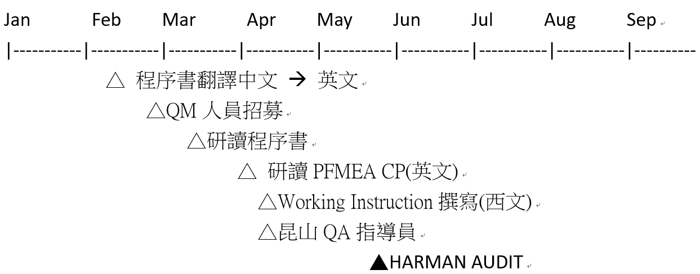

# CPMX Creation
## CPMX SCHEDULE
   1.	 Feb 02 正式核准投資方向 CPMX: IF503, RTM-Base: IF5H4 , RTM-Mainstream: IF5H3 , KITT-2 Audi: IFHH2, KITT-2 BMW: IFHH5

   
   

<table>
<thead>
	<tr>
		<th>Feb</th>
		<th>Mar</th>
		<th>Apr</th>
		<th>May</th>
	</tr>
</thead>
<tbody>
	<tr>
		<td>End: US Holding Company</td>
		<td></td>
		<td></td>
		<td></td>
	</tr>
	<tr>
		<td></td>
		<td>End: MX Company Ready</td>
		<td></td>
		<td></td>
	</tr>
	<tr>
		<td></td>
		<td></td>
		<td>Tax Registration</td>
		<td></td>
	</tr>
	<tr>
		<td></td>
		<td></td>
		<td>IMMEX Applying</td>
		<td></td>
	</tr>
	<tr>
		<td></td>
		<td></td>
		<td></td>
		<td>Harman Audit</td>
	</tr>
</tbody>
</table>

   2.	 SMT主要設備: 泰金寶CCMX轉移
        
<table>
<thead>
	<tr>
		<th>Mar</th>
		<th>Apr</th>
		<th>May</th>
	</tr>
</thead>
<tbody>
	<tr>
		<td>3rd Calibration (MSA)</td>
		<td></td>
		<td></td>
	</tr>
	<tr>
		<td>Material Arrive</td>
		<td></td>
		<td></td>
	</tr>
	<tr>
		<td>DOE 1</td>
		<td></td>
		<td></td>
	</tr>
	<tr>
		<td></td>
		<td>IMMEX Audit</td>
		<td></td>
	</tr>
	<tr>
		<td></td>
		<td>Moving</td>
		<td></td>
	</tr>
	<tr>
		<td></td>
		<td>DOE 2</td>
		<td></td>
	</tr>
</tbody>
</table>

SMT線帳面價值，cut-off date 可能會選在Jan/31/2023

金寶殘值USD 1,301,007.30

   3.	 SMT 新購設備: Feb. 10之前, 核示書完成
   
<table>
<thead>
	<tr>
		<th>Feb</th>
		<th>Mar</th>
		<th>Apr</th>
		<th>May</th>
	</tr>
</thead>
<tbody>
	<tr>
		<td>CCMX設備-&gt; CPMX</td>
		<td></td>
		<td></td>
		<td></td>
	</tr>
	<tr>
		<td>CCMX設備購買核示</td>
		<td>3rd MSA 核示</td>
		<td></td>
		<td></td>
	</tr>
	<tr>
		<td>RTM 新SMT 核示</td>
		<td></td>
		<td></td>
		<td></td>
	</tr>
	<tr>
		<td>KITT-2 新SMT核示</td>
		<td></td>
		<td></td>
		<td></td>
	</tr>
	<tr>
		<td></td>
		<td></td>
		<td>KITT-2 後段核示</td>
		<td></td>
	</tr>
</tbody>
</table>

墨西哥廠的生產設備核示書Feb 16提出

   4.	 選擇焊設備線: Feb. 10之前, 核示書完成
   
<table>
<thead>
	<tr>
		<th>Feb</th>
		<th>Mar</th>
		<th>Apr</th>
	</tr>
</thead>
<tbody>
	<tr>
		<td>選擇焊核示</td>
		<td></td>
		<td></td>
	</tr>
	<tr>
		<td>選擇焊 PO</td>
		<td></td>
		<td>選擇焊 Line到Reynosa</td>
	</tr>
</tbody>
</table>

墨西哥廠的生產設備核示書Feb 16提出

   5.	 組裝設備線: Feb. 10之前, 核示書完成
   
<table>
<thead>
	<tr>
		<th>Feb</th>
		<th>Mar</th>
		<th>Apr</th>
	</tr>
</thead>
<tbody>
	<tr>
		<td>組裝線 核示</td>
		<td></td>
		<td></td>
	</tr>
	<tr>
		<td>組裝線 PO</td>
		<td></td>
		<td>組裝線 到 REYNOSA</td>
	</tr>
</tbody>
</table>

墨西哥廠的生產設備核示書Feb 16提出

   6.	 測試儀器: Feb. 10之前, 核示書完成
   
<table>
<thead>
	<tr>
		<th>Feb</th>
		<th>Mar</th>
		<th>Apr</th>
	</tr>
</thead>
<tbody>
	<tr>
		<td>RTM測試儀 核示</td>
		<td></td>
		<td></td>
	</tr>
	<tr>
		<td>RTM測試儀 PO</td>
		<td></td>
		<td>RTM測試儀 到 REYNOSA</td>
	</tr>
</tbody>
</table>

   7.	 附屬生產設施: Feb. 10之前, 核示書完成
   
<table>
<thead>
	<tr>
		<th>Feb</th>
		<th>Mar</th>
		<th>Apr</th>
	</tr>
</thead>
<tbody>
	<tr>
		<td>附屬設施 核示</td>
		<td></td>
		<td></td>
	</tr>
	<tr>
		<td>附屬設施 PO</td>
		<td></td>
		<td>附屬設施 到 REYNOSA</td>
	</tr>
</tbody>
</table>

墨西哥廠的生產設備核示書Feb 16提出

   8.	 台北出差人員
   
<table>
<thead>
	<tr>
		<th>Feb</th>
		<th>Mar</th>
		<th>Apr</th>
		<th>May</th>
	</tr>
</thead>
<tbody>
	<tr>
		<td>21 Tony J 到CCMX</td>
		<td></td>
		<td></td>
		<td></td>
	</tr>
	<tr>
		<td>21 Tony S 到CCMX</td>
		<td></td>
		<td></td>
		<td></td>
	</tr>
	<tr>
		<td></td>
		<td>嚴文宏 到 CCMX</td>
		<td></td>
		<td></td>
	</tr>
	<tr>
		<td></td>
		<td></td>
		<td></td>
		<td></td>
	</tr>
</tbody>
</table>

   9.	 昆山出差人員

<table>
<thead>
	<tr>
		<th>Feb</th>
		<th>MAR</th>
		<th>Apr</th>
		<th>May</th>
	</tr>
</thead>
<tbody>
	<tr>
		<td>Row 1 Column 1</td>
		<td></td>
		<td></td>
		<td></td>
	</tr>
	<tr>
		<td>陳俊德  辦墨簽</td>
		<td>到REYNOSA</td>
		<td></td>
		<td></td>
	</tr>
	<tr>
		<td>張學金 辦墨簽</td>
		<td>到REYNOSA</td>
		<td></td>
		<td></td>
	</tr>
	<tr>
		<td>王昆 辦墨簽</td>
		<td>到REYNOSA</td>
		<td></td>
		<td></td>
	</tr>
</tbody>
</table>

   10. 印第安那廠支援墨西哥出差人員

<table>
<thead>
	<tr>
		<th>Feb</th>
		<th>Mar</th>
		<th>Apr</th>
		<th>May</th>
	</tr>
</thead>
<tbody>
	<tr>
		<td>R(?可行?)</td>
		<td>Reynosa</td>
		<td></td>
		<td></td>
	</tr>
	<tr>
		<td>M(不放)</td>
		<td>Reynosa</td>
		<td></td>
		<td></td>
	</tr>
	<tr>
		<td>K(?可行?)</td>
		<td>Reynosa</td>
		<td></td>
		<td></td>
	</tr>
	<tr>
		<td>J(?可行?)</td>
		<td>Reynosa)</td>
		<td></td>
		<td></td>
	</tr>
</tbody>
</table>

   11.	 LOCAL HIRE 人員
   
         面試之後填入資料
         

<table>
<thead>
	<tr>
		<th>Section</th>
		<th>Name</th>
		<th>Remark</th>
	</tr>
</thead>
<tbody>
	<tr>
		<td>Part Time</td>
		<td>Yang Ying</td>
		<td></td>
	</tr>
	<tr>
		<td>IT( Server , Client ) #2</td>
		<td></td>
		<td></td>
	</tr>
	<tr>
		<td>HR #1</td>
		<td></td>
		<td></td>
	</tr>
	<tr>
		<td>關務 #1</td>
		<td></td>
		<td></td>
	</tr>
	<tr>
		<td>財務 #1</td>
		<td></td>
		<td></td>
	</tr>
	<tr>
		<td>會計 #1</td>
		<td></td>
		<td></td>
	</tr>
	<tr>
		<td>總務 #1</td>
		<td></td>
		<td></td>
	</tr>
	<tr>
		<td>PM Supervisor</td>
		<td></td>
		<td></td>
	</tr>
	<tr>
		<td>QA Manager</td>
		<td></td>
		<td></td>
	</tr>
	<tr>
		<td>QA Supervisor</td>
		<td></td>
		<td></td>
	</tr>
	<tr>
		<td>Process Quality Engineer</td>
		<td></td>
		<td></td>
	</tr>
	<tr>
		<td>Project Quality Engineer</td>
		<td></td>
		<td></td>
	</tr>
	<tr>
		<td>SMT Supervisor</td>
		<td></td>
		<td></td>
	</tr>
	<tr>
		<td>Equipment management Supervisor</td>
		<td></td>
		<td></td>
	</tr>
	<tr>
		<td>Tetsing and assembly Supervisor</td>
		<td></td>
		<td></td>
	</tr>
	<tr>
		<td>Warehouse Supervisor</td>
		<td></td>
		<td></td>
	</tr>
	<tr>
		<td>Manufacturing Engineering Manager</td>
		<td></td>
		<td></td>
	</tr>
	<tr>
		<td>Process engineering Vice Manager</td>
		<td></td>
		<td></td>
	</tr>
	<tr>
		<td>Process engineering Supervisor</td>
		<td></td>
		<td></td>
	</tr>
	<tr>
		<td>Process engineering Engineer #?</td>
		<td></td>
		<td></td>
	</tr>
	<tr>
		<td>SMT Programming Engineer</td>
		<td></td>
		<td></td>
	</tr>
	<tr>
		<td>Process engineering Engineer #?</td>
		<td></td>
		<td></td>
	</tr>
	<tr>
		<td>Engineer / TE</td>
		<td></td>
		<td></td>
	</tr>
	<tr>
		<td>PE supervisor</td>
		<td></td>
		<td></td>
	</tr>
	<tr>
		<td>RF Engineer</td>
		<td></td>
		<td></td>
	</tr>
	<tr>
		<td>PE Engineer (Process engineer) #3</td>
		<td></td>
		<td></td>
	</tr>
	<tr>
		<td>Automation Supervisor</td>
		<td></td>
		<td></td>
	</tr>
	<tr>
		<td>Automatic electric control engineer</td>
		<td></td>
		<td></td>
	</tr>
	<tr>
		<td>Automation software engineer</td>
		<td></td>
		<td></td>
	</tr>
	<tr>
		<td>Automation mechanical engineer</td>
		<td></td>
		<td></td>
	</tr>
	<tr>
		<td>Automation engineer</td>
		<td></td>
		<td></td>
	</tr>
	<tr>
		<td>Failure Analysis Supervisor</td>
		<td></td>
		<td></td>
	</tr>
	<tr>
		<td>Failure Analysis Engineer</td>
		<td></td>
		<td></td>
	</tr>
</tbody>
</table>

## RTM SCHEDULE

2/14	　	        RMT Project get Award

2/15	2/21	7 	Award version Doc. Review

2/16	2/24	9 	CCSC review ( DFX, Gerber out review )

2/22	3/7	   16 	SMT&DIP carrier, printer block, stencil outsourcing fixture house

2/15	2/23	9 	Process maturity analysis for DOE

2/24	3/30	37 	Initial PFMEA & Control Plan For DOE

3/10		        DOE material ready

4/28		        Qualification material ready

3/13	3/15	3 	Thermal/B & TE test program/B build 12+3 pcs

			        SPI/AOI/AXI MSA verifiation
			        
			        SPI/AOI/AXI test program development 
			        
			        Iinitial process PPK study 
			        
3/15	3/22	8 	DOE 1 Base 32 + MS 30 pcs (CCMX 現地)

			        Dye & Pry soldering verfication
			        
			        CPMX ESD verification 
			        
			        Packing material verfication (Drop & vibration)
			        
4/11	4/14	4 	Install the machine at the CPMX site

			        New equipment CMK/MSA/ESD/MES/flatness verfication
			        
4/17	4/24	8 	DOE 2 Base 32 + MS 30 pcs (CPMX)

			        Process PPK study
			        
			        MES & Tracebility verfication
			        
5/10	5/22	13 	Qualification build ( PCBA )

5/25	5/30	6 	Sample build RTM ( Base : Glue solidify  防水膠凝固 )

10/2	10/24	23 	PPAP build ( PCBA & Ass'y )

## KITT-2 SCHEDULE

Sep’23  CPMX 設備更新完成:  S面水洗、underfill 設備、C面上壓製具迴流、XRay檢測設備、Burn-in & FT 測試環境 (Robot自動化 or manual烤箱,  加上 CB/AB setup…)、coplanarity量測、、、、

Sep’23  KS KITT2生產 PFMEA、CP、SOP、FA process、、、英(拉丁文)譯完成，轉交CPMX

Oct’23  CPMX 試產 KITT2 第一次 (TPE RD & KS 出差)
        (類似pilot run line transfer to mass production line管理)
        
Dec’23  CPMX 試產 KITT2 第二次  (Harman pre-audit, at least by Harman PM)

Jan’24  CPMX 生產 module and system qualification samples.

## SYSTEM SCHEDULE

## QUALITY MANAGEMENT

## PRODUCTION ENGINEERING

## CPMX Private Space

金寶同意增加到1884平方公尺

